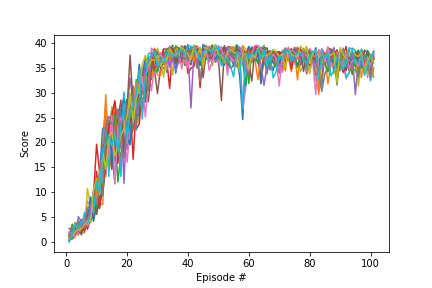

# DDPG for Unity Reacher

This repository implements a DDPG agent, which solves the Unity Reacher environment using 20 parallel agents. The code is based on the DDPG Pendulum implementation of this [repository](https://github.com/udacity/deep-reinforcement-learning/tree/master/ddpg-pendulum).

## Solution

I did most of my experiments on the environment with a single agent, but it required much more training time, and its performance was much worse. After I changed the environment to the one with 20 agent (and adapted the code), I was able to solve it within the first 100 timesteps.

Parameters I used:
* buffer_size = int(5e5): replay buffer size
* batch_size = 128: minibatch size
* gamma = 0.99: discount factor
* tau = 1e-3: for soft update of target parameters
* lr_actor = 1e-4: learning rate of the actor 
* lr_critic = 1e-3: learning rate of the critic
* weight_decay = 0: L2 weight decay
* update_every = 20: steps to wait between updates
* update_batch_number = 10: number of batches used in one update step
* Actor and Critic network parameters:
    * actor layers = 128, 256
    * critic layers = 128, 256
    * different normalization parameters: in the end, I used batch normalization after the first layer of the critic network

Besides these, I experimented with different Orstein-Uhlenbeck noise parameters, and decay of the noise itself.

Each of my episodes consisted of 1000 timesteps.

__Scores__

## Future steps

I am satisfied with the performance of the current agent. However, I would like to improve performance of the single-agent model, as it was far less satisfactory. Also, I'd like to compare the performance of A2C and REINFORCE.